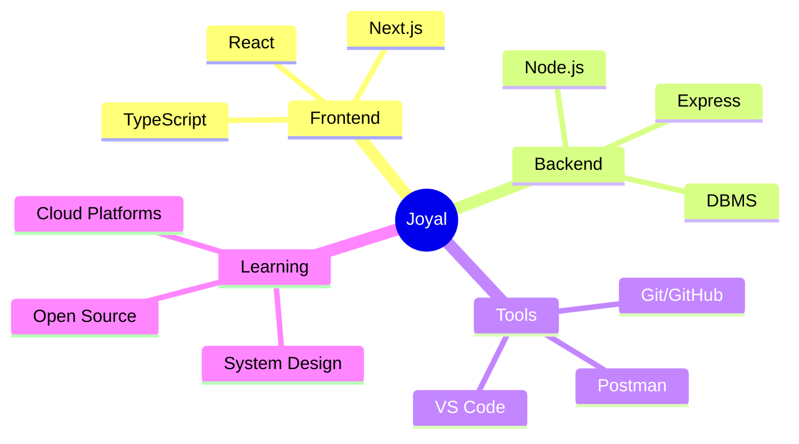

 #  Hi, I'm Joyal J Joy  

<div align="center">
  
</div>

<p align="center">
  
  
</p>

---

## 🚀 About Me


- 🔭 Currently working on exciting projects in the **tech industry**
- 🌱 Exploring & building with modern **web technologies**
- 🎯 **Goal:** Contribute to impactful open-source projects and keep leveling up
- 💬 Ask me about **software development**—always happy to help!
- 📫 Reach me at: **joyaljoy298@gmail.com**
- ⚡ Fun fact: I love turning coffee into code! ☕

<br clear="both" />

---

## 🛠️ Tech Stack & Tools

### 💻 Programming Languages
<p align="center">
  
</p>

### 🚀 Frameworks & Libraries  
<p align="center">
  
</p>

### 🗄️ Databases & Backend
<p align="center">
  
</p>

### 🔧 Tools & Platforms
<p align="center">
  
</p>

---

## 📊 GitHub Statistics

<div align="center">
  
  
</div>

<div align="center">
  
</div>

<div align="center">
  
</div>

---

## 🏆 GitHub Achievements

<div align="center">
  
</div>

---

## 💼 Skills Breakdown

<table>
<tr>
<td width="50%">

### 🎨 Frontend Development
```text
HTML/CSS        ████████████████████ 90%
JavaScript      ████████████████████ 85%
TypeScript      ███████████████████░ 80%
React           ███████████████████░ 85%
Next.js         ██████████████████░░ 75%
Tailwind CSS    ████████████████████ 90%
```

</td>
<td width="50%">

### ⚙️ Backend Development  
```text
Node.js         ███████████████████░ 80%
Express.js      ██████████████████░░ 75%
C/C++          ████████████████████ 85%
Python          ██████████████████░░ 70%
DBMS           ███████████████████░ 80%
API Testing     ████████████████████ 85%
```

</td>
</tr>
</table>

---

## 🎯 Current Focus

<div align="center">



</div>

---

## 📈 Contribution Graph

 <div align="center">
  
</div>
---

## 🌐 Connect With Me

<div align="center">
  <a href="https://www.linkedin.com/in/joyal-j-joy-410284286">
    
  </a>
  <a href="mailto:joyaljoy298@gmail.com">
    
  </a>
  <a href="https://github.com/JoyalJJoy">
    
  </a>
</div>

---

## 💡 Random Dev Quote

<div align="center">
  
</div>

---

## 🎵 Coding Playlist

 ## 🎵 Currently Listening To

<div align="center">
  
**🎧 My Coding Vibes:**
  
<table>
<tr>
<td align="center" width="25%">
  
</td>
<td align="center" width="25%">
  
</td>
<td align="center" width="25%">
  
</td>
<td align="center" width="25%">
  
</td>
</tr>
</table>

</div>

<div align="center">
  <h3>✨ Thanks for visiting my profile! ✨</h3>
  <p>Feel free to check out my repositories and don't forget to ⭐ them if you find something interesting!</p>
  
  
  
  <p>
    
    
  </p>
</div>

---

<div align="center">
  <sub>🤝 Open to collaborating on interesting projects and innovative ideas!</sub>
</div>
